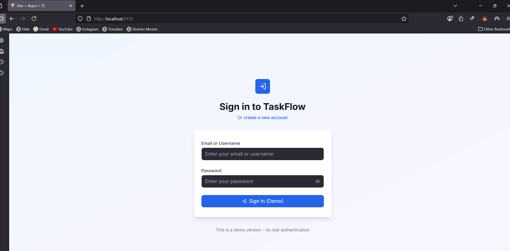
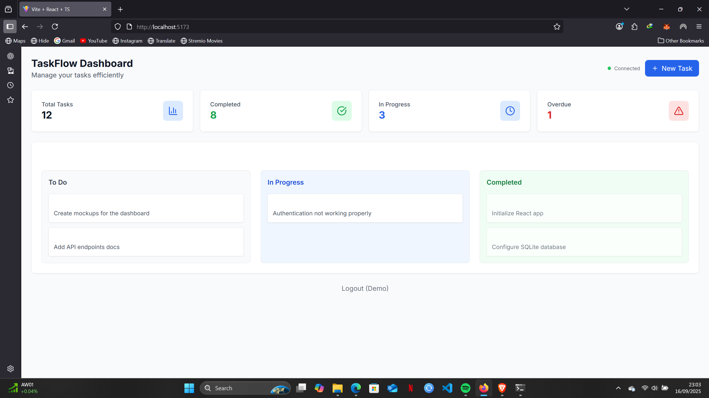

# TaskFlow - Modern Task Management Platform

A beautiful, real-time task management application built with React, Node.js, and Socket.IO.

## Screenshots

### Login Interface

*Clean and modern authentication interface with form validation*

### Dashboard & Kanban Board

*Comprehensive dashboard with stats cards and interactive Kanban board*

## Features

- 🚀 **Real-time collaboration** - See changes instantly across all connected users
- 🎨 **Beautiful UI** - Modern design with smooth animations and responsive layout
- 🔐 **Secure authentication** - JWT-based auth with protected routes
- 📱 **Drag & Drop** - Intuitive task management with drag-and-drop functionality
- 🌙 **Dark/Light mode** - Toggle between themes
- 🔍 **Smart filtering** - Filter tasks by status, priority, and date
- 📊 **Analytics dashboard** - Track productivity and task completion
- ⚡ **Fast performance** - Optimized for speed and efficiency

## Tech Stack

### Backend
- **Node.js** with Express.js
- **SQLite** database with Sequelize ORM
- **JWT** authentication
- **Socket.IO** for real-time features
- **bcrypt** for password hashing

### Frontend  
- **React 18** with TypeScript
- **Tailwind CSS** for styling
- **React DnD** for drag and drop
- **Socket.IO Client** for real-time updates
- **React Query** for state management
- **Framer Motion** for animations

## Getting Started

### Prerequisites
- Node.js 18+ 
- npm (comes with Node.js)

### Quick Start (Windows)

1. **Clone or extract this project**
2. **Open PowerShell in the project folder**
3. **Run the startup script:**
   ```powershell
   .\start-dev.ps1
   ```

### Manual Setup

1. **Install backend dependencies:**
   ```bash
   cd backend
   npm install
   npm start
   ```

2. **In a new terminal, install frontend dependencies:**
   ```bash
   cd frontend  
   npm install
   npm run dev
   ```

3. **Open your browser:**
   - Frontend: http://localhost:5173
   - Backend API: http://localhost:5000/api

### First Time Setup
1. Open http://localhost:5173
2. Click "Create a new account"
3. Fill out the registration form
4. Start creating and managing tasks!

### Features Demo
- ✅ **Create tasks** with different priorities and due dates
- ✅ **Drag and drop** tasks between columns (To Do → In Progress → Completed)
- ✅ **Real-time updates** - open multiple browser tabs to see live sync
- ✅ **Search and filter** tasks
- ✅ **Task statistics** and progress tracking
- ✅ **Beautiful animations** and smooth interactions

## Project Structure

```
taskflow-app/
├── backend/                 # Express.js API server
│   ├── src/
│   │   ├── controllers/     # Route controllers
│   │   ├── models/          # Database models
│   │   ├── middleware/      # Custom middleware
│   │   ├── routes/          # API routes
│   │   └── utils/           # Utility functions
│   ├── database.db          # SQLite database
│   └── server.js           # Entry point
├── frontend/               # React application
│   ├── src/
│   │   ├── components/     # Reusable components
│   │   ├── pages/          # Page components
│   │   ├── hooks/          # Custom hooks
│   │   ├── services/       # API services
│   │   └── utils/          # Utility functions
│   └── public/             # Static assets
└── README.md
```

## Contributing

1. Fork the repository
2. Create a feature branch
3. Commit your changes
4. Push to the branch
5. Open a Pull Request

## License

This project is licensed under the MIT License.